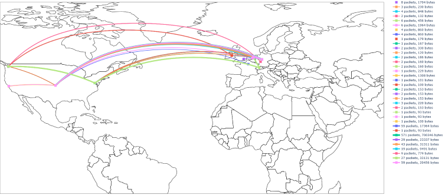

<h1 align="center">
    
     
    🌐 Traceroute Map
</h1>

See the paths all your packets took as your browse the internet at a leisurely pace.
In addition to the ip addresses, we make use of traceroute to iteratively discover how this packet was (likely) routed
from you to said server (or vice-versa, depending on how you look at it).

We use make use of https://geolocation-db.com/ to get latitude and longitude of IP addresses.
These are cached locally so we don't have to keep looking up the same locations.

## Usage

You can invoke the script with the following arguments:

    traceroute_map.py [-h] [-p PROJECTION] [-t TIMEOUT] [-d DURATION]
                         [--clean]

    Map traces

    optional arguments:
      -h, --help            show this help message and exit
      -p PROJECTION, --projection PROJECTION
                            type of map projection
      -t TIMEOUT, --timeout TIMEOUT
                            traceroute timeout
      -d DURATION, --duration DURATION
                            amount of seconds to track traffic
      -l LOG_LEVEL, --log-level LOG_LEVEL
                            log level, one of: 'debug', 'info', 'warning', 'error',
                            'critical'
      -m MODE, --mode MODE  display mode, one of: 'light', 'dark'
      --display-name        display names of traces
      --clean               clear cache of ip latitudes and longitudes and look
                            them up again

## Output

Aside from the graphical overview, we also output a `*.log` file with all the IP addresses and their geographical
locations in latitude and longitude format.

Note that all IP's for which we cannot find a location are discarded.

## Dependencies

Makes use of:
- `geopy` v2.1.0
- `scapy` v2.4.4
- `plotly` v4.14.3
- `pandas` v1.2.3
- `pymodbus` v2.5.0

